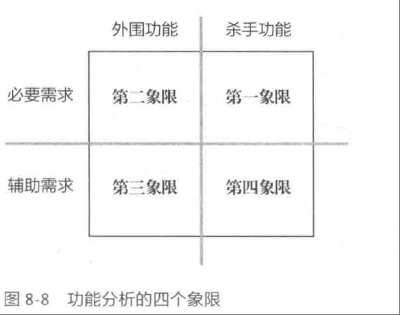

# 
[I.1] 个人作业：阅读和提问

——coder0xe

| 项目                                     | 内容                                                         |
| :--------------------------------------- | :----------------------------------------------------------- |
| 这个作业属于哪个课程                     | [2025春季软件工程(罗杰、任健)](https://edu.cnblogs.com/campus/buaa/BUAA_SE_2025_LR) |
| 这个作业的要求在哪里                     | [[I.1]个人作业：阅读和提问](https://edu.cnblogs.com/campus/buaa/BUAA_SE_2025_LR/homework/13365) |
| 我在这个课程的目标是                     | 在PSP中精进个人代码技术，在TSP中提高团队合作凝聚力           |
| 这个作业在哪个**具体方面**帮助我实现目标 | 阅读教材《构建之法：现代软件工程》，了解敏捷开发的方法论     |

## 问题一、在结对编程中是否会出现1+1<2的情况？

> 见教材4.5.2小节中对于“为什么要结对编程”的描述：
>
> “在结对编程中，因为有随时的复审和交流，程序的各方面质量取决于一对程序员中各方面水平较高的一位”

* 我的问题：在结对编程的编程模式中，一个人充当领航员、另一个人充当驾驶员的模式事实上对于两个人的能力都提出了较高的要求。我们假设这样一个场景，一个水平较低的程序员做领航员，另一个水平较高的程序员作为驾驶员，这样的场景下，领航员可能会对于驾驶员写出的一些高级的数据结构或算法并不熟悉，领航员如果对驾驶员不断提问，就会造成1+1<2的效果，反而降低了驾驶员的效率；如果不进行提问，充当驾驶员的看客，也就失去了领航员的意义，1+1=1. 是否只有在两个程序员水平都较高的场景下，结对编程才有意义？

## 问题二、杀手功能的辅助需求为什么是最低的优先级？

> 见教材8.5小节中对于功能的定位和优先级的象限图定义：
>
> 

* 我的问题：为什么杀手功能的辅助需求只有第四象限的优先级？杀手功能是我们的项目把用户从竞争对手那里吸引过来的杀手锏，是项目的特色。作为杀手功能的必要需求排在第一优先级，而作为杀手功能的辅助需求为什么会排在作为外围功能的辅助需求之后？我的排序是：杀手功能的必要需求>外围功能的必要需求>杀手功能的辅助需求>外围功能的辅助需求.

## 问题三、在AI辅助编码工具流行的今天应当如何估计项目开发时间？

> 见教材《构建之法：现代软件工程》8.6.3小节上下文对于开发时间的估计:
>
> "软件工程师在长期的实践中，摸索出一套经验公式: 实际时间花费主要取决于两个因素——对某件事的估计时间X, 以及他做过类似开发工作的次数N.
> $$
> Y=X\pm X/N
> $$

* 我的问题：在本书出版时间时(2014年)还不流行AI辅助编码工具，假设程序员coder0xe完全不熟悉某个项目的技术流程，在当年可能他的做法是到网上搜索相关案例进行参考，在N=0的条件下可能成为完全做不出来的反面例子，但在AI辅助编码工具流行的今天，即使我们对某项技术不熟悉，仍然可以通过`github copilot`, `cursor`等AI辅助编码工具快速、成熟地完成某一项目模块的开发，这时我们的时间应当如何估计呢？

## 问题四、在小团队中“侵官之害胜于寒”有必要吗？

> 见13.5.2小节中对于分工问题的描述：
>
> “不同的角色在开发过程中相互合作、相互制约的作用，不能替代。测试人员在做验证测试时需要做多方面、多平台的我测试，这些工作量也许远远超过了开发人员的能力范围。”

* 我的问题：在一个小团队中，比如我们的软工组队，往往大家的岗位流动性较大，一个人干完了这一件事可以立即着手去帮助别人完成别人的工作，这在一定程度上会提高工作效率，推进项目进度。书中的对于分工的明确划分是否更加适用于大团队+大项目，而对于小团队敏捷开发的小型项目是否可以进行职责之间的转换？

## 问题五、在Beta期间，不必要修复同类的类似bug吗？

> 见15.1.7小节中对于“修复Bug的门槛逐渐提高”的描述：
> “在Beta阶段，修复Bug的门槛要逐渐提高，昨天修复了同类的bug，今天如果还找到了类似的问题，团队未必要修复。”

* 我的问题：软件的Bug是软件质量的重要问题，假如在Beta阶段发现了致命的bug,例如在某个API上有泄漏用户信息的风险，已经修复了一个，对于其余的同类bug，难道没有修复的必要吗？在我们之前写过的程序中，对于bug是锱铢必较的，可以说是“打地鼠”式的改bug方式，一个bug出现了立马消灭这个bug，这种方式在软件工程中可以改为“按照优先级修复bug”，但是对于同类的重要Bug还是有修复的必要性。