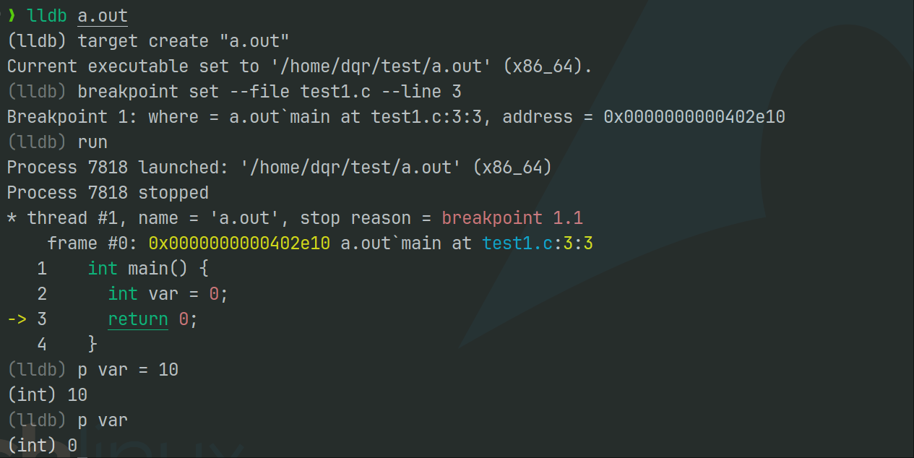

# <div align="center">[I.2]个人作业：软件案例分析</div>

<div align="right">——coder0xe</div>

| 项目                                     | 内容                                                         |
| :--------------------------------------- | :----------------------------------------------------------- |
| 这个作业属于哪个课程                     | [2025春季软件工程(罗杰、任健)](https://edu.cnblogs.com/campus/buaa/BUAA_SE_2025_LR) |
| 这个作业的要求在哪里                     | [[I.2]个人作业：软件案例分析](https://edu.cnblogs.com/campus/buaa/BUAA_SE_2025_LR/homework/13367) |
| 我在这个课程的目标是                     | 在PSP中精进个人代码技术，在TSP中提高团队合作凝聚力           |
| 这个作业在哪个**具体方面**帮助我实现目标 | 分析市场上的软件案例，全面地了解软件工程的原理在好/坏软件上的作用 |

## 0. 选题介绍

​	本次作业选择开源项目进行分析，我选择面向C/C++/C#/Swift的一款调试工具LLDB进行分析。LLDB全称Lowel-Level Debugger, 是苹果公司开发的一款开源、高性能的源代码级调试器，作为Clang和LLVM项目的一部分，LLDB为提供了丰富的功能和灵活的接口，使得开发者能够有效地定位和修复代码中的bug。与之类似的调试工具还有gdb等经典的调试工具，我选择gdb进行比较分析。

参考材料：

* [LLDB开源代码](https://github.com/llvm/llvm-project/tree/main/lldb)
* [LLVM项目github主页](https://github.com/llvm/llvm-project)

## 1. 调研、评测

### 1.1 软件评测

#### 1.1.1 软件使用

​	LLDB是一款较为新兴的源代码调试工具，由于已经具有GDB调试C/C++代码的经验，我选择直接使用lldb工具并使用`help`命令来查看具体有哪些调试指令，lldb具有的调试命令如下输出：


​	下面针对几个常见的指令进行使用：

* breakpoint：设置断点
* step：步进（进入语句中调用的函数）
* stepi：汇编指令步进
* next：步过（跳过语句中调用的函数）
* nexti：汇编指令步过
* run：运行调试目标
* print：打印变量的值
* file：指定调试文件
* quit/exit：退出LLDB调试器
* **gui：居然提供了GUI调试页面！**

​	我编写了一个简单的但又不失复杂性的CPP程序来实践调试流程，内容是首先创建一棵7个节点的满二叉树，而后进行层序遍历，输出每一层的结果，其中使用了new等内存分配关键字，可以作为调试过程中查看内存分配的目标：

```cpp
#include <iostream>
#include <queue>
#include <vector>
using namespace std;

typedef struct Tnode {
  int data;
  struct Tnode *left, *right;
} Tnode, *Tree;

void InitTree(Tree &T) {
  T = new Tnode{1, nullptr, nullptr};
  Tnode *left = new Tnode{2, nullptr, nullptr};
  Tnode *right = new Tnode{3, nullptr, nullptr};
  T->left = left;
  T->right = right;
  left = new Tnode{4, nullptr, nullptr};
  right = new Tnode{5, nullptr, nullptr};
  T->left->left = left;
  T->left->right = right;
  left = new Tnode{6, nullptr, nullptr};
  right = new Tnode{7, nullptr, nullptr};
  T->right->left = left;
  T->right->right = right;
}

vector<vector<int>> LevelOrder(const Tree T) {
  if (!T)
    return vector<vector<int>>{};
  vector<vector<int>> res;
  queue<Tnode *> q;
  q.push(T);
  while (!q.empty()) {
    int size = q.size();
    vector<int> row;
    while (size--) {
      Tnode *node = q.front();
      q.pop();
      row.push_back(node->data);
      if (node->left)
        q.push(node->left);
      if (node->right)
        q.push(node->right);
    }
    res.push_back(row);
  }
  return res;
}

int main() {
  Tree T = nullptr;
  InitTree(T);
  vector<vector<int>> res = LevelOrder(T);
  for (int i = 0; i < res.size(); i++) {
    cout << "Row " << i + 1 << ": ";
    for (int j = 0; j < res[i].size(); j++) {
      cout << res[i][j] << " ,";
    }
    cout << endl;
  }
  return 0;
}
```

> * 编译指令：
>
>   ```shel
>   clang++ -g test.cpp -o test.out
>   ```

* 调试过程：

  1. lldb: 进入调试

  2. file test.out：选择调试文件

  3. 首先在InitTree函数尾部打断点，之后运行`run`，停在函数尾部，使用命令查看内存分配情况

     ```cpp
     breakpoint set --file test.cpp --line 24
     ```

     

  4. 查看内存分配情况：`memory read <address>`

     

  5. 使用continue指令继续运行代码，在层序遍历处打断点，使用逐步调试和输出的方式进行测试。

     * 打印当前队列头节点的值

       

     * 使用n/s逐步调试，空格默认重复上一次的指令

       

  6. **体验一下GUI页面**

     

#### 1.1.2 软件分析

​	通过写一个具体的CPP程序来体验LLDB调试工具，我的主观感受上从GDB到LLDB的技术跨度不大，可以说会使用GDB就可以无伤上手LLDB,毕竟还有help嘛！LLDB丰富的调试指令可以为用户提供细致精确的调试体验，可以满足我当前的技术水平和工程规模的调试需求。

​	作为一个调试工具，与传统的调试工具GDB相比，我认为LLDB是在一定程度上超过了GDB的使用体验的，主要在以下几方面：

* **在用户界面上：**
  * 相比GDB，LLDB在断点处提供了更加丰富的上下文代码信息，便于用户查看
  * LLDB提供了GUI页面，而GDB只提供了TUI页面，LLDB相对更加用户友好
* **在调试功能上：**
  * LLDB兼容了GDB的基本指令模式，技术跨度小
  * LLDB的指令比GDB更加丰富，`help`指令说明详细
* **在情怀上(误)：**
  * 谁会拒绝用LLVM全家桶呢？

#### 1.1.3 改进意见

​	[LLDB的官方文档](https://lldb.llvm.org/#)中介绍了GDB到LLDB的指令映射，这是让我惊喜的一点，这体现了软件工程中对于用户体验的考量，让使用GDB的老家伙们乐于使用LLDB作为调试工具而不用从头摸索。**作为建议的一点是：建议加入专门介绍调试指令的文档**，目前的文档只详细介绍了breakpoint(断点指令)的详细使用，对于其他指令则缺乏介绍。同时，**建议美化GUI页面，我喜欢花花绿绿的页面！**

#### 1.1.4 用户调研

* 采访对象的背景：选择王德庆老师软件工程班的沈锎同学进行采访，沈锎同学经常编写Rust/
* 采访对象实际使用的产品栏目：
* 采访对象使用软件中会遇到的问题和亮点：
* 采访对象觉得从用户体验的角度来说需要改进的地方有哪些：

#### 1.1.5 评测结论

- a) 非常不推荐
- b) 不推荐
- c) 一般
- d) 好，不错
- e) 非常推荐

​	我的结论是：d）好，不错

### 2.Bug分析和提交

​	作为一个调试工具，我在使用LLDB进行代码调试过程中发现了一些bug. 我的系统环境：

* Archlinux内核版本：6.13.6
* LLVM/Clang/LLDB版本：19.1.7

#### 2.1 Bug1

##### 2.1.1 bug复现

* 可复现性：必然触发

* 调试的代码：

  ```cpp
  int main() {
    int var = 0;
    return 0;
  }
  ```

* 编译指令：` clang test.c -O1 -g -static`

* 调试过程如下：

  

* 可以发现，在成功修改`var`变量的值后，再次打印`var`值却显示原来的值

##### 2.1.2 bug分析

​	通过查看DWARF区域的内存情况，我们可以观察到`var`变量的属性

```shell
 <2><32>: Abbrev Number: 3 (DW_TAG_variable)
    <33>   DW_AT_const_value : 0
    <34>   DW_AT_name        : (indexed string: 0x5): var
    <35>   DW_AT_decl_file   : 0
    <36>   DW_AT_decl_line   : 2
    <37>   DW_AT_type        : <0x3c>
```

​	这个变量有一个DW_AT_const_value属性，这就是造成它不可被修改的原因。

​	**可能成因：**回顾大三上学期完成的SysY Compiler的项目经验, 从编译系统的角度分析这个问题，我认为这个bug的可能成因是在函数分配栈内存时发生了错误，错误地为变量分配了const的属性。

​		**bug的严重性**：在程序员调试代码过程中，修改变量值的场景不在少数，修改变量值的错误会很大程度的影响程序员的调试体验，但是在一定程度上可以被程序员及时发现，不会造成很大的损失。**另外在此处我们针对调试工具给出发生bug的严重等级评价：**

* 五颗星：这些bug会导致调试工具完全无法使用，或者导致调试过程中出现严重的数据丢失或安全问题。例如，调试工具在启动时崩溃，或者调试过程中导致被调试程序的数据损坏。
* 四颗星：这些bug会严重影响调试工具的主要功能，可能导致调试过程无法继续。例如，频繁的崩溃，或者关键功能（如设置断点、查看变量）无法正常工作。
* 三颗星：这些bug会显著影响调试工具的使用体验，但通常有解决方法或替代方案。例如，调试过程中偶尔出现的崩溃，或者某些复杂表达式无法正确求值。
* 二颗星：这些bug可能会影响某些特定功能的使用，但不会导致调试工具完全无法使用。例如，某些特定情况下的表达式求值错误，或者某些特定平台上的兼容性问题。
* 一颗星：这些bug通常不会影响调试工具的主要功能，只是一些小的瑕疵或不便。例如，某些命令的输出格式不正确，或者某些功能的文档不够详细。

​	这个bug我对它的评价是：**三颗星**。

​	**软件团队为何未能修复？** LLDB隶属于LLVM开源社区，LLVM project是一个庞大的编译系统开源项目，对于庞大的编译系统来说，在编译某些程序时产生bug是可能的，或者说是可以忍受的、可以理解的。**我认为这次bug的发生可能是因为开发人员对于边缘情况没有考虑到位，同时测试人员没有进行周到的测试。**

##### 2.1.3 bug改进建议

​	在断点处`p var = 10`应当可以正常的修改变量的值。

##### 2.1.4 bug反馈

​	我选择在Github上的LLVM代码库中向开发者提出issue，[链接🔗](https://github.com/llvm/llvm-project/issues/130906)

#### 2.2 Bug2

##### 2.2.1 bug复现

* 可复现性：必然触发

* 调试的代码：

  ```cpp
  class Test {
    static const int a[];
  };
  const int Test::a[] = {1};
  
  int a(int val) { return val; }
  
  int main(int argc, char const *argv[]) {
    return a(2); // break here
  }
  ```

* 编译指令：` clang++ test2.cpp -stdlib=libc++ -g -o test2.out`

* 调试过程如下：

  

* 解释：我们在Test命名空间(namespace)中创建了变量a，这个变量我们在main函数中应当是不可见的，即我们在main函数中调用a(1)，LLDB应当认为我们在调用函数a，而通过LLDB的报错信息我们可以发现LLDB认为我们是对a这个Test命名空间中的变量进行了`()`重载，这明显是错误的。

##### 2.2.2 bug分析

​	**可能成因：**LLDB中对于命名空间的解析以及变量作用域的范围解析出现问题，以至于我们要调用函数a，LLDB却认为我们是在对Test命名空间中的a变量进行了`()`重载。

​	**bug的严重性：**三星。

​	**软件团队为何未修复？** 我认为是因为开发人员的疏忽和测试人员测试不全面造成的。

##### 2.2.3 bug改进建议

​	这里应当调用函数a, 传参1。

##### 2.2.4 bug反馈

​	我选择在Github上的LLVM代码库中向开发者提出issue，[链接🔗](https://github.com/llvm/llvm-project/issues/130908)

## 2.分析

### 2.1 工作量分析

​	下图为LLDB开源代码的文件结构：


​	将代码clone到本地并使用代码统计工具cloc来统计代码行数，总代码行数为3w+行数。对于一个6人左右的计算机专业的大学毕业生，在开发层面上我们估计每个人每天大概能开发500行左右代码，总体开发时间在10天左右，加上5天测试等时间，共需要15天时间。 

### 2.2 软件质量分析

​	目前市场上面向C/C++的调试工具主要为GDB和LLDB。与GDB相比，LLDB具有以下优势：

- 通常在性能和内存使用方面表现更好，特别是在处理大型项目时。
- 使用更现代的代码基础和优化技术，提供更快的调试体验。
- 提供与 GDB 类似的调试功能，支持断点、观察点、单步执行、堆栈跟踪、变量查看和修改等。
- 在多线程调试和远程调试方面表现更好，提供更稳定的体验。
- 提供命令行界面（CLI），支持多种图形用户界面（GUI）前端，如 Xcode、Visual Studio Code 等。
- 命令行界面设计更现代，命令更直观，易于学习和使用。

​	综合来看我愿意把LLDB排在第一名的位置。

​	**对LLDB开发团队的建议：改进稳定性、错误处理和恢复机制。**

## 3.建议和规划

### 3.1 市场现状

### 3.2 市场与产品生态

### 3.3 产品规划

