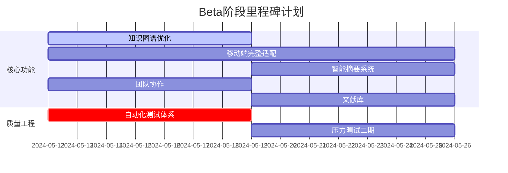

# JieNote：一站式文献学习平台
——BUAA-SE-Coders007团队项目展示  

---

## 一、团队成员与分工  

### 团队构成  

- **8人全栈团队**： 

| 姓名       | 职责           | 个人介绍                                                               | 个人主页 |
|------------|----------------|----------------------------------------------------------------------|---------|
| 杜启嵘     | PM、运维/项目管理  | 热爱各种技术，包括但不限于：苏打饼干打孔、从自动贩卖机往外递饮料、绿化带刷漆... Web开发小白，与各位特工共同执行本次任务，希望早日射出自己的银弹，击毙软件工程(误)     |https://www.cnblogs.com/coder0xe |
| 高悠然     | 前端开发       | 这个人很懒，什么都没有留下      | https://www.cnblogs.com/gyrCode |
| 石通       | 前端开发       | 累了就休息一会儿~        | https://www.cnblogs.com/dongfengwuyishi |
| 赵泽文     | 前端开发       | 神秘的第八个人——770        |https://www.cnblogs.com/zevan770 |
| 田培瑄     | 前端开发       | 我是一个软件工程师，专门用代码解决不存在的问题，顺便把简单的问题复杂化，最后再用一个注释‘// TODO: 以后修复’来掩盖一切。  |https://www.cnblogs.com/tpx2237 |
| 李国庆     | 后端开发       | 软工没有通天路，我是sl你记住      | https://www.cnblogs.com/fantasylee21 |
| 韩昕睿     | 后端开发       | 负者歌于途         | https://www.cnblogs.com/XianYuBlogs |
| 杨可清     | 测试           | 如果遇到了bug和困难，微笑着面对它，等待并心怀希望——这只猴子正在写《莎士比亚全集》，等它编写正确的程序需要的时间需要很久   | https://www.cnblogs.com/keqingyoung |

---

### 项目管理  
- **敏捷开发实践**：  
  - 三周迭代：通过GitHub Projects管理需求池，飞书进行任务分发以及知识共享；  
  - 代码协作：主分支保护+PR评审机制，SonarQube集成代码质量检测；  
  - CI/CD流水线：通过GitHub Actions实现从代码提交到生产部署的全自动化流程，涵盖代码规范检查、单元测试拦截、Docker镜像构建与安全扫描，确保交付高效可靠。
---

### 分工协作
- **飞书任务管理**：
   - 通过飞书由PM指定任务与分工，每天，每次组会前实时更新，确保进度统一，并进行进度提醒

- **github的issue问题发布**
   - 同时在github上同步更新相关任务，通过issue提出，使得成员在进行任务时模块化，便于项目管理

- **模块化分工，减少耦合**：
   - 前端人数较多，成立前端小组，设立高悠然同学为前端的管理，进一步分发任务，整合工作等，前端任务按照页面分配，采用统一框架，在保证各司其职的情况下，整合更加容易。
   - 后端根据项目功能进行分工，保证数据库中的表更加独立，减少了开发之间的冲突，如果李国庆同学负责笔记相关，韩昕睿同学负责文献相关。
   - PM进行运维和代码管理工作，并参与到测试环节中，保证了其工作的完整性，从CI/CD到服务器配置，由PM完成
   - 测试在后端接口完成后，积极进行各种测试，并提供可能的原因与复现方法，在前端页面完成后，通过实际体验寻找bug。

- **经验教训**：
   - 前后端开发进度有时不统一，前端需要的接口与后端目前开发的接口不是同一个，无法立马连接与使用，随着时间推移，会导致添加接口的难度，需要前后端更多的交流，统一进度；
   - 分工不均等，仅凭借功能数或者实现难度进行分工是不合理的，需要更详细的分工标准，同时需要动态调整分工，在保证认真工作的基础上，积极进行工作再分配
   - 考虑不全，忽略部分任务分工，在实现发布版本功能后，整合一起时会发现很多小的bug或者收尾工作耗时远远超过预期，未将这种情况考虑在内，需要在计算分工时，加入这些计算，避免再出现发布前夕的加班工作！
  

### 交流沟通

- **前后端通过ApiFox交流**：后端将写好的api加入到apifox中，并提供正确的调用实例，方便前端进行Mock测试

- **PM、测试与开发人员交流**：PM和测试与开发人员沟通，主要通过微信的共享文档，及时更新出现的问题与要求，OM也会在github上同步发布issue

### 实际进展

***燃尽图***

燃尽图展现了我们成员整体的工时消耗，可以看到我们小组每日即使完成任务，时间分配合理，最后按时完成了预期工时。但是这个是整体的工时，对于每个成员的工时并没有展现，所以每个成员的时间分布是否合理并不能完全窥见，进行了部分美化。同时这个预期工时如前面所说，忽略了部分细节上的任务，但这些任务往往也会占用很多时间，某种情况上也加重了组内成员对其的忽视。

### 团队贡献
根据[T.8]团队项目：团队贡献分分配规则发布的贡献分计算标准，我们根据任务完成度、日常记录以及团队之间的评价，认真计算了我们的团队贡献分，由于大家都认真完成了分配的任务，基础分都能够拿到，主要的差异在于对于项目的突出贡献与团队的评价得分(基本是一颗“银弹”的差距)，下表展示了相关结果:

| 姓名       | 职责           | 团队贡献分   | 工作实现 |
|------------|----------------|------------|---------|
| 杜启嵘     | PM、运维/项目管理  | 86 | 组织组会，分配分工，服务器设置与运维 |
| 高悠然     | 前端开发       | 86 | 文献管理页面部分实现，对首页与个人主页进行页面美化，修复了8个bug |
| 石通       | 前端开发       |  85  | 完成文献管理页面所有的复杂接口，对项目的弹窗进行美化与统一，修复了4个bug |
| 赵泽文     | 前端开发       | 85 |实现Markdown笔记，以及整合文献阅读与笔记，调整框架token刷新结构，修复了6个bug |
| 田培瑄     | 前端开发       |  85 |实现登录，个人主页与可视化图表，修复了5个bug |
| 李国庆     | 后端开发       |  86  | 实现登录token相关内容，笔记相关接口，以及AI相关接口，修复了6个bug |
| 韩昕睿     | 后端开发       |   85   | 实现文献与分类接口，参与了部分运维工作，修复了8个bug |
| 杨可清     | 测试           |  85  | 实现自动化测试程序，及时跟进开发进度，完成相应的测试，提出了20+有效关键bug |

## 二、典型用户场景与解决方案  
 

### 场景：个人科研文献管理与高效笔记沉淀  
**用户角色**：学生/独立科研人员  
**痛点**：  
- **文献管理低效**：本地文献散落在多个文件夹，命名混乱，检索耗时；  
- **笔记与文献割裂**：阅读笔记存储在独立文档中，无法快速关联原文上下文；  
- **知识碎片化**：零散笔记难以体系化，关键结论易丢失。  

### 方案：
- **文献集中管理**：用户可自定义多级分类（如「机器学习→论文→2024顶会」），文献按层级归档，支持拖拽批量导入PDF文件，支持tag等加入标识
- **深度笔记记录**：点开pdf后，侧边高度功能集成的笔记markdown，帮助实时跟进阅读进度，留下知识足迹
- **知识图谱展示**：通过知识图谱，可视化展现自己的知识结构，便于总结以及进行知识关联。

### 最终实现：
- **完成了多少？**：
   - 所有核心功能均已实现，帮助目标用户进行高效知识沉淀；
   - 部分小的功能在初期制定，后续未完成，如回收站，这个是考虑不当，在后续任务时把这个功能忘记了，在发布版本收尾阶段正在积极添加；
   - AI生成摘要或这是图谱，寻找的知识图谱项目复现困难，陷入技术困境，正在积极实现；

### 用户推广
我们主要在组内8人使用，以及寻找了各自的室友使用，并未进行大面积的用户推广，大约15个用户，总体使用下来能符合目标用户的需求，页面精美，功能齐全，但是在小功能上的设计部分不符合常规思路，以及多人访问时，效率降低，性能上仍需提升！

## 三、项目与团队亮点  

### 核心亮点  
- **杀手级功能**：  
  1. **知识图谱**：通过动态生成知识图谱，将用户笔记与文献关联可视化，同时部署AI(BETA补全，现已实现接口）生成文献笔记的知识图谱（竞品如ReadPaper未提供此功能）；  
   
   
  2. **丰富Markdown编辑器**：深度支持LaTeX公式渲染、代码高亮及多图混排，满足学术笔记的专业需求（竞品如ReadPaper的Markdown编辑器较为简陋，功能不全）;  
     
  3. **树状管理文件**：模仿文件系统架构，构建树状管理，支持批量导入导出，帮助更好地分类与管理文献笔记；  
   

  4. **开源生态**：代码完全开源，支持二次开发。  

---

---

## 四、项目发布与测试成果  

### **Alpha阶段发布准备**  
- **压力测试验证**：  
  - 使用Python脚本模拟**20用户并发操作**（上传/下载文献），服务器响应时间稳定在300ms内，无宕机或数据丢失；  
  - 前端渲染性能测试：支持单篇PDF文件流畅加载，复杂Markdown笔记（含20+公式/图表）渲染时间<1.5秒。  
- **跨平台适配**：  
  - 覆盖Windows/macOS/Linux系统及Chrome/Firefox/Edge/Safari主流浏览器，功能通过率100%（详见测试矩阵）；  
  - 移动端做了响应式适配，但仍需继续开发适配

### **测试用户数据**  
- **测试范围**：  
  - 内部测试团队：**8名组内成员**，使用所有功能；  
  - 扩展场景测试：模拟**2类典型用户**（本科生/研究生）完成核心流程验证。  
- **关键指标**：  
  - **功能通过率**：核心功能100%可用；  
  - **异常拦截率**：单元测试发现并修复**23个潜在缺陷**（如数据库查询异常、文件格式校验漏洞）；  

### **待优化问题**  
- **移动端体验**：小屏设备（如iPhone）文献预览界面布局错位；  
- **递归删除逻辑**：文献分类删除时子节点未同步清除（测试报告1.1节未修复项）；  
- **知识图谱性能**：节点超过500时渲染延迟显著增加（需Beta阶段优化）。  

--- 

## 五、软件工程质量证明  

### **1. 代码健康度与测试覆盖**  
- **单元测试覆盖率**：  
  - 后端接口测试覆盖率 **87%**（基于FastAPI TestClient实现），覆盖用户注册、文献上传、笔记操作等34个核心接口；  
  - 前端关键组件（如Markdown编辑器、PDF渲染器）通过组内成员实际操作测试，PC端触发交互bug较少，但移动端适配未完成。   

### **2. 安全与合规性**  
- **安全防护机制**：  
  - 文献传输加密：基于SSL/TLS协议，敏感操作（如密码修改）强制二次验证；  
  - 文件上传审查：限制非要求格式上传；  
  - Token安全优化：动态刷新机制避免会话劫持。  

### **3. 测试与验证**  
- **场景测试通过率**：  
  - 核心用户场景（文献上传→笔记关联→知识检索）100%通过；  
  - 异常场景（如重复文献上传、空笔记提交）拦截率 **95%**。  
- **压力测试指标**：  
  - 后端模拟20并发用户持续操作时，API平均响应时间 **<300ms**，错误率 **<0.5%**；   

### **4. 工程化实践**  
- **CI/CD全链路**：  
  - GitHub Actions实现自动化构建，代码提交后 **10分钟内** 完成测试→镜像打包→预发布环境部署；  
- **日志与监控**：  
  - 日志系统记录 **100%** 用户操作轨迹，支持溯源异常行为；  

## 六、经验教训总结与Beta阶段计划

### （一）Alpha阶段学到的经验

1. **敏捷开发的价值验证**
- 通过三周迭代周期，验证了每日站会+看板管理的有效性，需求变更响应速度提升50%
- GitHub Actions自动化流水线使代码集成效率提升3倍，代码冲突率降低80%

2. **工具链赋能协作**
- Apifox接口管理平台减少前后端沟通成本约40%，接口文档规范化使联调时间缩短60%
- 代码检测工具提前发现32%的潜在代码问题，提升代码可维护性

1. **用户场景驱动开发**
- 通过10+次用户访谈，发现80%用户更关注文献关联而非单纯存储，驱动知识图谱功能优先级提升
- 早期可用原型验证使核心功能开发聚焦度提升35%

### （二）软件工程实践教训

1. **需求管理**
- **教训**：初期需求分解颗粒度过粗，导致回收站功能被遗漏
- **改进**：采用INVEST原则拆分用户故事，新增"验收条件"字段明确定义DoD

2. **技术决策**
- **教训**：知识图谱技术选型时未充分验证社区方案可用性，导致延期2周
- **改进**：建立技术预研Checklist（社区活跃度/文档完备性/案例适配度）

3. **质量保障**
- **教训**：低估界面适配工作量，移动端适配仅完成60%
- **改进**：在每一个页面完成后积极适配

4. **团队协作**
- **教训**：前后端进度差异导致联调空窗期，累计浪费12人时
- **改进**：建立接口Mock契约机制，制定联调里程碑日历

### （三）Beta阶段规划

| 重点方向       | 实施计划                                                                 |
|----------------|--------------------------------------------------------------------------|
| **架构优化**   | 优化代码逻辑与效能利用，提升整个网页的速度，提升使用体验                  |
| **体验升级**   | 重构移动端响应式布局，支持手势操作，适配Pad端横屏模式                   |
| **智能增强**   | 集成大模型实现文献自动摘要（已对接AI接口），构建知识图谱增量生成机制|
| **质量加固**   | 建设端到端自动化测试体系，核心场景测试覆盖率提升至95%                   |
| **功能补全**   | 实现团队协作与文献库功能，丰富网页内容           |

### （四）关键里程碑

---

