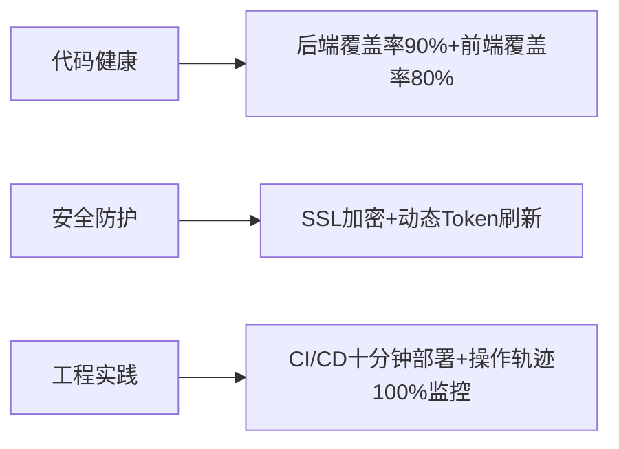
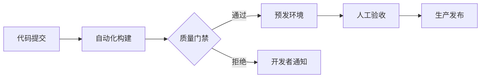

# JieNote：一站式文献学习平台  
——BUAA-SE-Coders007团队项目展示  

---

## 一、团队成员与分工

### 团队构成

* **8人全栈团队**：

| 姓名  | 职责         | 个人介绍                                                                                                                      | 个人主页                                                                               |
| --- | ---------- | ------------------------------------------------------------------------------------------------------------------------- | ---------------------------------------------------------------------------------- |
| 杜启嵘 | PM、运维/项目管理 | 热爱各种技术，包括但不限于：苏打饼干打孔、从自动贩卖机往外递饮料、绿化带刷漆... Web开发小白，与各位特工共同执行本次任务，希望早日射出自己的银弹，击毙软件工程（误） Beta阶段负责项目需求规划、自动化部署与运维，持续跟踪新功能开发进度 | [https://www.cnblogs.com/coder0xe](https://www.cnblogs.com/coder0xe)               |
| 高悠然 | 前端开发       | 这个人很懒，什么都没有留下      Beta阶段负责文献库阅读和推荐功能的前端实现                                                                                | [https://www.cnblogs.com/gyrCode](https://www.cnblogs.com/gyrCode)                 |
| 石通  | 前端开发       | 累了就休息一会儿\~        Beta阶段负责组织协作功能和页面UI优化                                                                                   | [https://www.cnblogs.com/dongfengwuyishi](https://www.cnblogs.com/dongfengwuyishi) |
| 赵泽文 | 前端开发       | 神秘的第八个人——770        Beta阶段负责Markdown编辑器升级、回收站与搜索功能实现                                                                      | [https://www.cnblogs.com/zevan770](https://www.cnblogs.com/zevan770)               |
| 田培瑄 | 前端开发       | 我是一个软件工程师，专门用代码解决不存在的问题，顺便把简单的问题复杂化，最后再用一个注释‘// TODO: 以后修复’来掩盖一切。Beta阶段负责移动端适配、悬浮预览和AI助手功能前端实现                            | [https://www.cnblogs.com/tpx2237](https://www.cnblogs.com/tpx2237)                 |
| 李国庆 | 后端开发       | 软工没有通天路，我是sl你记住      Beta阶段负责文献库管理、全文搜索接口、回收站逻辑及部分AI接口                                                                    | [https://www.cnblogs.com/fantasylee21](https://www.cnblogs.com/fantasylee21)       |
| 韩昕睿 | 后端开发       | 负者歌于途         Beta阶段负责组织协作权限管理、知识图谱算法和AI文献综述接口                                                                            | [https://www.cnblogs.com/XianYuBlogs](https://www.cnblogs.com/XianYuBlogs)         |
| 杨可清 | 测试         | 如果遇到了bug和困难，微笑着面对它，等待并心怀希望——这只猴子正在写《莎士比亚全集》，等它编写正确的程序需要的时间需要很久   Beta阶段负责测试所有新功能，撰写测试用例并进行Bug管理                           | [https://www.cnblogs.com/keqingyoung](https://www.cnblogs.com/keqingyoung)         |

### 项目管理

* **敏捷开发实践**：Alpha和Beta阶段采用两周迭代开发与一周测试发布，每次迭代结束都有演示与回顾，并使用GitHub Projects和飞书进行需求管理、任务分配和知识共享；
* **代码协作和质量保障**：持续使用主分支保护+PR评审机制，SonarQube持续集成代码质量检查；新增自动化安全扫描和性能测试工具，确保代码的可维护性与安全性；
* **CI/CD流水线**：GitHub Actions流水线保持自动构建、测试与部署，新的性能压力测试环节也已集成，验证每次提交后的系统稳定性。

### 分工协作

* **飞书任务管理**：由PM在飞书发布日常和冲刺任务，保持每次组会前更新进度并提醒团队成员；

* **GitHub Issue同步**：所有任务在GitHub上模块化发布，通过Issue跟踪进度，方便团队查阅和协作；

* **团队分工**：前端团队按照页面和功能模块分组协作，组织协作、笔记、搜索等功能由对应开发者负责；后端团队按功能模块划分，李国庆同学负责文献库，笔记与A1接口，韩昕睿同学负责组织协作，文献与权限接口；PM兼顾运维与管理工作，测试团队根据文档编写用例，及时反馈问题。
* **经验教训**：Beta阶段中，我们意识到接口契约管理至关重要，在开发前期需要明确Mock数据以便前后端并行；分工时还应动态调整任务量，确保每位成员负载均衡；测试团队建议尽早介入需求阶段，提早设计测试方案以发现潜在问题。

### 交流沟通

* **前后端通过Apifox交流**：后端将API加入到Apifox中，并提供调试实例，前端团队可以进行Mock测试与验证接口规范；
* **团队沟通机制**：PM、测试与开发人员通过飞书任务文档和共享表格实时同步问题与需求，定期召开原型评审会和用户反馈讨论会，确保团队对需求变化达成共识。
* **按时组会制度**：严格进行7次以上组会，每天汇报与总结，严格push成员，正常推进进度！

### 实际进展

***燃尽图***
Beta阶段团队持续使用燃尽图监控工时和进度，结果显示各项功能开发和测试进度基本与计划一致。文献库和组织协作等核心功能按时完成，但移动端适配和AI功能测试投入时间超出了预期，验证了前期遗漏细节任务会导致返工的经验，也说明我们应该在过程中预留更多缓冲时间和资源。

### 团队贡献

根据\[T.8]团队项目贡献评分规则，我们结合任务完成度、日常记录和团队互评结果认真计算了贡献分。下表显示了Beta阶段各成员工作实现情况，贡献分是结合alpha后计算所得：

| 姓名  | 职责         | 团队贡献分 | 工作实现                                      |
| --- | ---------- | ----- | ----------------------------------------- |
| 杜启嵘 | PM、运维/项目管理 | 96    | 领导Beta需求评审，参与测试，维护环境与CI/CD流水线，承担部分自由人工作，按需分配               |
| 高悠然 | 前端开发       | 96    | 完成组织具体页面，丰富搜索，文献综述以及知识图谱功能，修复5个不给            |
| 石通  | 前端开发       | 95    | 完成组织管理页面，优化整体UI一致性，修复7个bug             |
| 赵泽文 | 前端开发       | 96    | 升级Markdown编辑器和悬浮预览功能，实现回收站功能，修复8个Bug    |
| 田培瑄 | 前端开发       | 95    | 完善文献库页面，实现AI助手窗口功能，修复6个Bug           |
| 李国庆 | 后端开发       | 96    | 实现文献库、搜索和AI后端接口，优化数据库查询，修复8个Bug       |
| 韩昕睿 | 后端开发       | 96    | 实现组织协作，回收站以及权限管理接口，修复12个bug           |
| 杨可清 | 测试         | 95    | 制定并执行Beta阶段测试计划，撰写并运行自动化测试，发现并报告20+个重要Bug，同时参与前端pdf编写，完成pdf编辑功能 |

---

## 二、典型用户场景与解决方案

**场景**：个人/团队科研文献管理与协作
**用户角色**：学生/独立科研人员/小组组长

**痛点**：

* 文献管理零散：本地文献数量庞大但缺乏统一分类，传统搜索效率低下；
* 协作需求：缺少团队阅读和讨论机制，组内难以同步笔记和见解；
* 功能碎片化：笔记与文献关联弱，缺乏全局搜索和统一视图；
* 知识沉淀受限：手动梳理耗时，无AI智能帮助提炼和关联知识。

**方案**：

* **智能文献库与推荐**：提供多级分类和标签管理、批量导入功能，并可根据用户兴趣和阅读记录自动推荐相关文献，实现一站式文献归档和发现；
* **组织协作功能**：支持用户创建和加入研究组织，在组织空间内共享文献和笔记，组长/管理员权限确保内容审核和小组管理，方便团队共同研读和标注；
* **笔记深化与AI增强**：集成**Markdown编辑器**（支持LaTeX公式、代码高亮等）和**PDF编辑器**，满足学术笔记需求；内置AI助手实时解答疑问，并自动生成文献**知识图谱**和**综述摘要**，帮助用户提炼关键结论；
* **高级检索与管理**：全局搜索支持按关键词、标签、作者等检索笔记和文献；新增**回收站**功能，可恢复误删文献，提高资料管理便捷性；
* **交互优化体验**：新增悬浮预览功能，使用户在列表页悬停即可查看文献摘要或笔记内容，无需打开新页面；整体界面进一步美化，提升易用性和一致性。

**最终实现**：

* **核心功能完成**：文献库阅读、组织协作、全局搜索、回收站和AI知识图谱等Beta阶段核心功能均已实现并投入使用；
* **优化和提升**：Markdown编辑器与PDF编辑功能大幅增强（支持拖拽上传、公式渲染、多图排版等），系统性能优化，在单篇PDF加载和笔记渲染效率方面表现稳定；AI助手已接入，可进行实时问答与自动摘要生成；
* **遗留改进项**：移动端部分布局尚需细化优化，知识图谱展示节点过多时渲染效率待提升，某些复杂查询的响应速度还可进一步优化。

### 用户推广

* 内部测试团队保持8人，同时设立了体验群，收集体验用户反馈，总用户规模约20+人；
 
* 反馈显示总体体验较好，页面精美，功能完善，但同时也有部分信息泄露以及交互设计不合理等问题；
* 不足之处在于当前访问量增长时系统响应速度略有下降，需要进一步优化后端性能，扩大用户群体并进行压力测试。

---

## 三、项目核心亮点  

### 杀手级功能展示  
1. **树状文献管理**  
树状分类结构支持批量导入导出，tag标签等帮助你更好识别文献

2. **AI驱动知识沉淀**  
文献自动生成知识图谱，可视化展示知识关联  
  

单篇文献自动生成内容综述，快速掌握核心观点  
  

3. **团队协作空间**  
组内共享文献与笔记，实现知识交流  
  

多级权限管理体系，组长审核规范内容  
  

4. **专业学术编辑器**  
支持LaTeX公式、代码高亮、多图混排的Markdown编辑器，以及可编辑的PDF阅读器，实时跟踪您的阅读足迹
  

5. **回收站**  
误删文献一键恢复  
  

6. **个人主页**  
个性主页，记录知识沉淀足迹
 

6. **精巧工具**  
我们网站提供了很多小的功能，提高用户的使用效率，以下给出一些示例：
悬浮预览：鼠标悬停查看文献摘要  
  

AI助手：实时解答学术问题  
  

全局搜索：快速寻找文献库或者个人文献中的资料

**杀手级功能对比**：
| 功能 | JieNote | Zotero | ReadPaper |
|------|---------|--------|---------|
| 树状文件管理 | ✔️ | ✘ | ✘ |
| 团队协作 | ✔️  | ✔️ | ✔️ |
| 文献库 | ✔️  | ✘ | ✔️ |
| 学术级编辑器 | ✔️ LaTeX+PDF | 基础标注 | 文本编辑 |
| 智能知识图谱 | ✔️ | ✘ | ✘ |
---

## 四、项目成果与验证  

### 关键性能指标  
| 测试类型       | 测试方案                | 结果                  |
|---------------|-----------------------|---------------------|
| 压力测试       | 50用户并发操作          | 响应<300ms，错误率<0.2% |
| 兼容性测试     | Win/macOS/Linux+主流浏览器 | 功能通过率100%         |
| 文献加载测试   | 含公式/图表复杂笔记       | 渲染时间<2秒          |

### 用户验证数据  
- **测试规模**：20人（8团队成员+收集的体验者）  
- **核心反馈**：  
  + 在开源库中，未能很好的保护数据，暴露了敏感信息，少数接口权限设置有误
  + 部分按钮有些小问题，整体美观，功能齐全，能精准定位到目标用户
  + 部分交互设计并不是很符合使用规划，应该进行调整
  使用上总体反馈良好，只有部分细节需要修改，同时面临一个信息泄漏的严重问题，但均已修复

---

## 五、软件工程质量体系  

### 全链路质量保障  

**CI/CD实践**：

### 核心质量指标  
- 单元测试覆盖率：**后端90%/前端80%**  
- 异常场景拦截率：**98%**  
- 自动化测试占比：**核心场景100%覆盖**  

### 项目是否有出现代码混乱，没有注释，没有详细文档的问题？明年的同学继续开发这个项目，会不会出现以上抱怨？
***我们对我们项目编写了详细的使用README，环境在组内多种电脑下均无问题，且对于关键业务代码有详细注释，前后端业务分离，很多内容包装完善，我们相信，其他开发者尝试接手我们的项目时能很快上手！***

---

## 六、项目总结与经验沉淀  

### 关键突破  
1. **功能特色**：  
   - 树状管理文献笔记，帮助知识整理
   - 实现学术级Markdown编辑器（LaTeX+代码高亮）  
   - AI驱动的文献智能摘要以及笔记联动知识图谱

2. **工程实践**：  
   - 建立前后端标准化接口契约（Apifox）  
   - 构建自动化安全扫描+性能测试流水线  
   - 实现复杂学术内容的秒级渲染优化  

### 经验沉淀  
| 领域       | 经验教训                  | 最佳实践                  |
|------------|-------------------------|-------------------------|
| 需求管理    | 移动端需求拆解不足导致返工     | 验收标准前置+用户场景验证       |
| 技术决策    | 知识图谱技术选型初期调研不足    | 建立技术预研Checklist机制     |
| 质量保障    | 高并发场景测试覆盖不足       | 自动化压力测试集成CI/CD       |
| 团队协作    | 前后端进度异步造成空窗期      | 接口Mock契约+每日组会沟通      |

> **工程箴言**：  
> "不是所有闪光的都是银弹，但持续打磨定能击穿痛点"  
> —— Coders007 团队 2025夏

> 项目开源地址：https://github.com/BUAA-SE-coders007  
> 在线体验地址：https://jienote.top

---