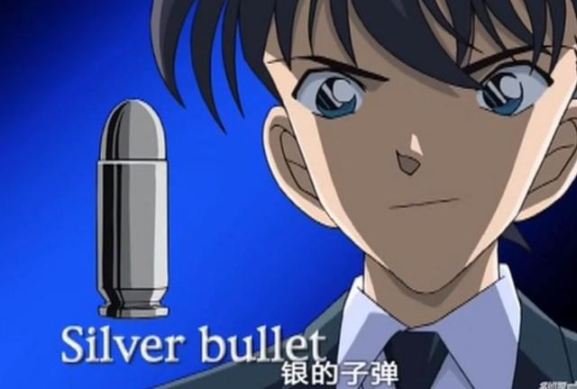
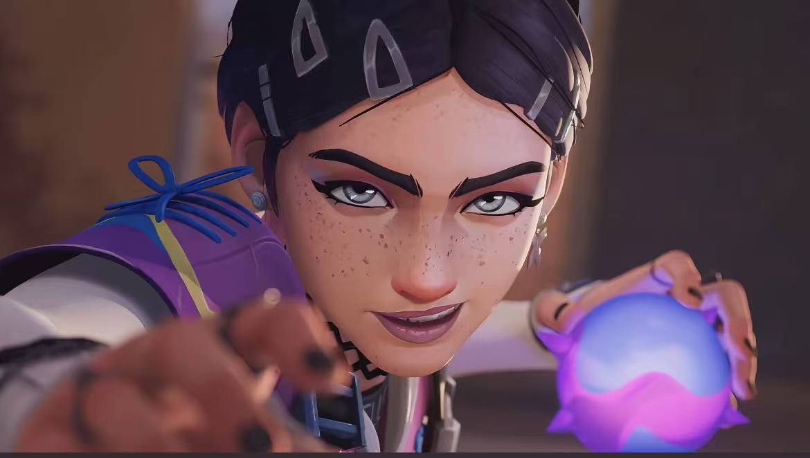

# 
[T.1]团队项目：团队成员介绍

——coders007团队

| 项目                                     | 内容                                                         |
| :--------------------------------------- | :----------------------------------------------------------- |
| 这个作业属于哪个课程                     | [2025年春季软件工程(罗杰、任健)](https://edu.cnblogs.com/campus/buaa/BUAA_SE_2025_LR) |
| 这个作业的要求在哪里                     | [[T.1]团队项目：团队成员介绍](https://edu.cnblogs.com/campus/buaa/BUAA_SE_2025_LR/homework/13366) |
| 团队在这个课程的目标是                   | 实践敏捷软工项目、在做中学中精进软件开发技术                 |
| 这个作业在哪个**具体方面**帮助我实现目标 | 初步确定团队角色分工、熟悉团队成员                           |

## 0、软件工程没有Silver Bullet

​	coders007团队由7位来自北京航空航天大学2022级计算机学院的同学组成，他们是（字典序）：杜启嵘、高悠然、韩昕睿、李国庆、石通、田培瑄、杨可清。团队取名创意来自经典的特工电影《007》，其中特工邦德的形象成为经典。

​	软件工程领域中有一句著名论断：“软件工程没有银弹”，意指并没有单一的技术或方法能够彻底解决软件开发中的所有问题。我们团队的目标是通过团队七位特工的特工技术（代码之力）结合敏捷开发的方法论，成为软件工程领域的“银弹”团队，让007特工们射出的银弹再飞一会！

## 1、团队成员介绍

### 1.1  杜启嵘

> 热爱各种技术，包括但不限于：苏打饼干打孔、从自动贩卖机往外递饮料、绿化带刷漆... Web开发小白，拜在各位特工门下共同执行本次任务，希望早日射出自己的银弹(我赌你的枪里没有子弹)，击毙软件工程(误)

* 本次行动分工：团队PM，前端架构和部分页面实现

### 1.2 高悠然

> 这个人很懒，什么都没有留下

* 本次行动分工：担任前端开发的工作

### 1.3 韩昕睿

> 负者歌于途

* 本次行动分工：后端架构和后端API实现

### 1.4 李国庆

> 软工没有通天路，我是sl你记住

* 本次行动分工：主要负责后端开发

### 1.5 石通

> 累了就休息一会儿~

* 在本次行动分工：主要负责前端设计和开发的工作

### 1.6 田培瑄

> 我是一个软件工程师，专门用代码解决不存在的问题，顺便把简单的问题复杂化，最后再用一个注释‘// TODO: 以后修复’来掩盖一切。

* 本次任务分工：部分项目前端开发工作

### 1.7 杨可清

> 如果遇到了bug和困难，微笑着面对它，等待并心怀希望——这只猴子正在写《莎士比亚全集》，等它编写正确的程序需要的时间需要很久

* 本次任务分工：运维和测试工作

## 2、我们的口号

### 
让银弹再飞一会！

