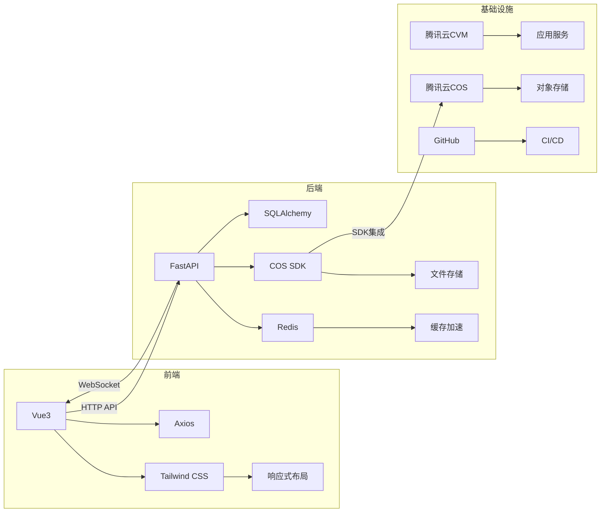
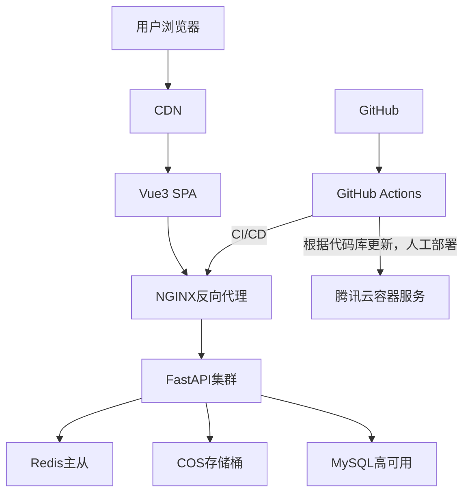
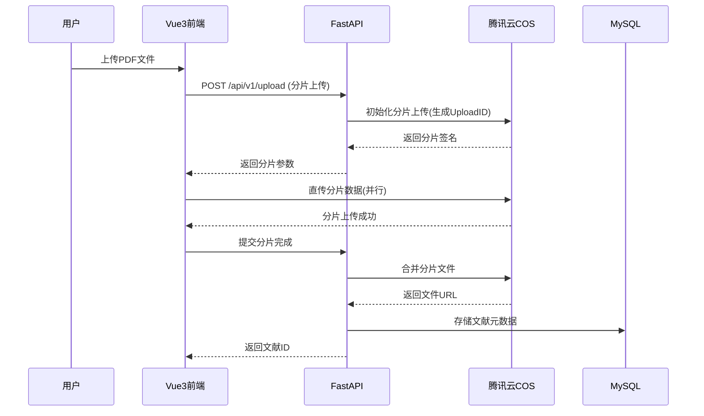
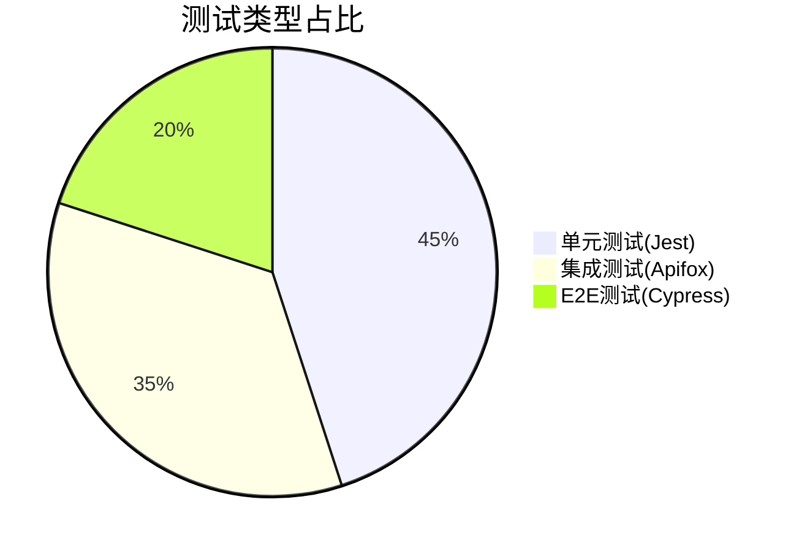

|项目|内容|
|---|---|
|这个作业属于哪个课程|[2025年春季软件工程（罗杰、任健）](https://edu.cnblogs.com/campus/buaa/BUAA_SE_2025_LR)|
|这个作业的要求在哪里|[[T.6] 团队项目：技术规格说明书](https://edu.cnblogs.com/campus/buaa/BUAA_SE_2025_LR/homework/13413)|
|我在这个课程的目标是|学习软件工程知识，通过团队协作开发一个具备实际应用价值的软件，从需求分析、设计、开发到测试和部署，完整经历软件开发生命周期，提高工程实践能力。|
|这个作业在哪个具体方面帮助我实现目标|确定软件的技术栈，软件架构规格等，明确技术要求，帮助高效开发|

# JieNote 技术规格说明书

## 1. 文档目标
本技术规格书旨在明确以下核心问题：
1. **技术架构全景**：建立前后端技术栈的协同关系模型
2. **系统交互边界**：定义各组件的数据流动与控制逻辑
3. **功能设计讨论**：对软件的功能进行设计与详备讨论

---

## 2. 技术栈
我们采用传统的前后端分模块编写，以及运维测试及时根据模块进度进行阶段的单元测试，集中测试，与最后的端到端的整体测试，并涵盖多种情况与压力测试，下面是我们的技术栈和模块设计与交互。

### 2.1 技术选型说明

| 层级 | 技术组件 | 交互关系 | 选型依据 |
|------|----------|----------|----------|
| 前端框架 | Vue3 | 通过Axios调用FastAPI接口 | 组合式API支持复杂状态管理 |
| 样式引擎 | Tailwind CSS | 与Vue组件深度集成 | 原子化CSS加速开发迭代 |
| 后端框架 | FastAPI |生成OpenAPI文档供前端调试 | 异步IO支持高并发场景 |
| 缓存服务 | Redis |通过Redis-py连接FastAPI | 毫秒级热点数据响应 |
| 对象存储 | COS SDK |集成腾讯云Python SDK | 支持分片上传/下载加速 |
| 测试工具 | Apifox | 模拟200+API测试场景 | 可视化，黑箱接口调试 |

### 2.2 技术栈关系


---

## 3. 系统架构设计

### 3.1 软件功能设计


### 3.2 部署拓扑


### 3.3 核心交互流程
#### 文献上传场景：


---

## 4. 实现文档

+ 功能说明文档：每个功能需要实现到什么水准，有一个基线功能，以及后续需要拓展的功能；
+ 接口实现文档：后端与前端交互的文档，前端根据功能实现页面，并告诉后端需要得到的数据，后端根据需求写接口，并设置输入与返回值，必须详细到每一个功能与接口信息(输入、输出、姓名、异常码等)；
+ 测试文档：测试人员与运维与coder交互的文档，模块完成后即使测试反馈，沟通，需要详尽每个bug的触发概率，方式以及可能原因；
+ 实现日志；记录每次实现的功能，便于大家了解进度，推进项目，提高效率。
---

## 5. 测试体系

### 5.1 测试计划


### 5.2 性能基准

| 场景 | 指标 | 目标值 | 测试方法 |
|------|------|--------|----------|
| 文献上传 | 吞吐量 | ≥10MB/s | 使用较大内存测试文件测试 |
| 笔记修改与保存 | 响应时间 | <500ms | 模拟20并发写操作 |
| 图谱生成 | 响应时间 | <1min | 构建复杂的树状结构进行测试 |
| 批量导入与导出 | 吞吐量 | ≥10MB/s | 使用较大内存测试文件测试 |

---

## 6. 实际应用假设
+ 为了方便管理，我们将树的深度锁定在三级——文件夹-文献-笔记，当到笔记一层时，不会给予创建按钮
+ 文献数据格式目前仅支持PDF，笔记仅支持markdown，其中允许使用latex的公式语法
+ 用户的注册采用邮箱注册，需发送验证码

---

## 7. 技术风险评估与应对策略

### 7.1 风险评估等级
根据 **影响程度** 对技术风险进行分级：

| 风险等级 | 影响范围 | 应对优先级 |
|----------|----------|------------|
| **P0**  |  灾难性   | 必须立即解决 |
| **P1**  |  严重     | 需在迭代周期内解决 |
| **P2**  | 中度     | 长期监控并优化 |
| **P3**  | 轻度     | 记录并观察 |

---

### 11.2 关键风险识别与应对

#### **1. 第三方云服务中断（P0）**
- **风险描述**：  
  腾讯云 COS 或 CVM 服务区域性故障，导致文献存储和核心服务不可用。
- **触发场景**：  
  云服务商数据中心出问题，或者服务器承受压力大，崩溃
- **影响**：  
  用户无法上传/下载文献，系统完全瘫痪。
- **应对措施**：  
  该种问题过大，由于设备能力有限，只能优化算法，提升服务器的容纳能力，如果有更大型的平台，可以使用备份等，或者征得用户同意，本地实现备份。

---


#### **2. 敏感数据泄露（P0）**
- **风险描述**：  
  用户隐私数据（如账号密码、文献摘要、笔记草稿）因 API 漏洞被未授权访问。
- **触发场景**：  
  JWT 令牌泄露或越权查询漏洞（如 `GET /notes?user_id=他人ID`）。
- **影响**：  
  违反 GDPR 等法规，导致法律诉讼及用户流失。
- **应对措施**：  
  - **动态权限校验**：  
    ```python
    # FastAPI 权限中间件
    def check_owner(note_id: str, user: User):
        note = await db.get_note(note_id)
        if note.owner != user.id and user.role != "admin":
            raise HTTPException(403, "无权访问该资源")
    ```
  - **数据加密**：  
    - 对用户的账号密码进行严格加密，管理员也无法直接获取
    - 有条件可以对文献进行加密，实时校验获取人的权限

---
