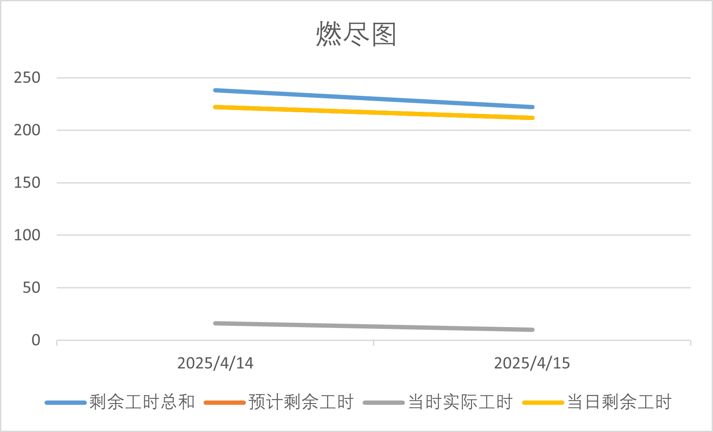

# 
[T.9.3]团队项目：Alpha第三=一次Scrum Meeting

**日期：**2025年4月15日
**会议主要内容概述：**

* 第一次每日进度会，会议主要内容为
  * 投屏展示前两天框架搭建的工作成果
  * 讨论这两天遇到的各种问题
  * 确定下未来工作方向的工作内容，在飞书中同步更新

## 一、进度情况

| 组员   | 负责    | 两日内已完成的工作                                           | 后两日计划完成的工作                                | 工作中遇到的困难 |
| :----- | :------ | :----------------------------------------------------------- | :-------------------------------------------------- | :--------------- |
| 高悠然 | 前端    | [树状结构实现](https://github.com/BUAA-SE-coders007/JieNote_frontend/commit/3869b832946c4a84b2a5e45729370e830e09ee77) | 对页面进行美化，完善功能                            | 暂无困难         |
| 石通   | 前端    | [文献管理页面新功能开发](https://github.com/BUAA-SE-coders007/JieNote_frontend/commit/baea8cd1ef6f920f2a5510c276be71fb1c4466a3) | 对页面进行美化，调通接口                            | 暂无困难         |
| 田培瑄 | 前端    | [添加注册登录功能](https://github.com/BUAA-SE-coders007/JieNote_frontend/commit/796e449168ae4b4e32cde29bd08ae05623a68405) | 完成个人页面，调研pdf渲染和编辑的技术栈             | 暂无困难         |
| 赵泽文 | 前端    | 暂未动工                                                     | 完成网页端markdown编辑器的初版                      | 暂无困难         |
| 李国庆 | 后端    | [完成登录注册和异步框架]([[chore\]: 将后端代码换为异步程序，提高服务效率 · BUAA-SE-coders007/JieNote_backend@3718933](https://github.com/BUAA-SE-coders007/JieNote_backend/commit/3718933f96af79eb3cd3263260e81520fdfbf224)) | 调用知识图谱的构建                                  | 暂无困难         |
| 韩昕睿 | 后端    | 暂未动工                                                     | 完成Article类的增删改查                             | 需要进一步学习   |
| 杨可清 | 测试    | 添加提交检测                                                 | 跟随后端代码的API接口编写进度完成相应的单元测试编写 | 暂无困难         |
| 杜启嵘 | 运维/PM | 分支规范约定，PR审核                                         | 部署后端所需AI服务，储存服务                        | 暂无困难         |

## 二、燃尽图

## 三、会议记录

